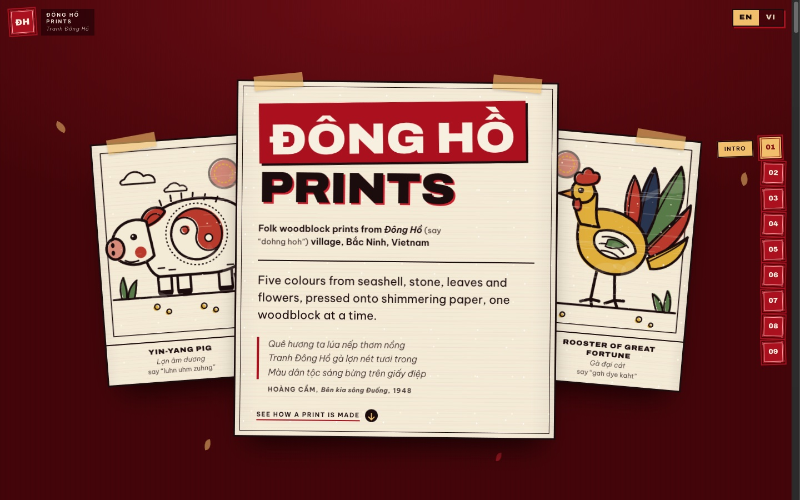
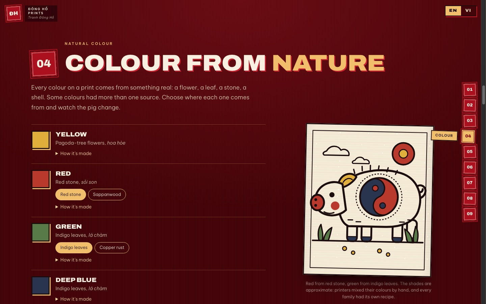
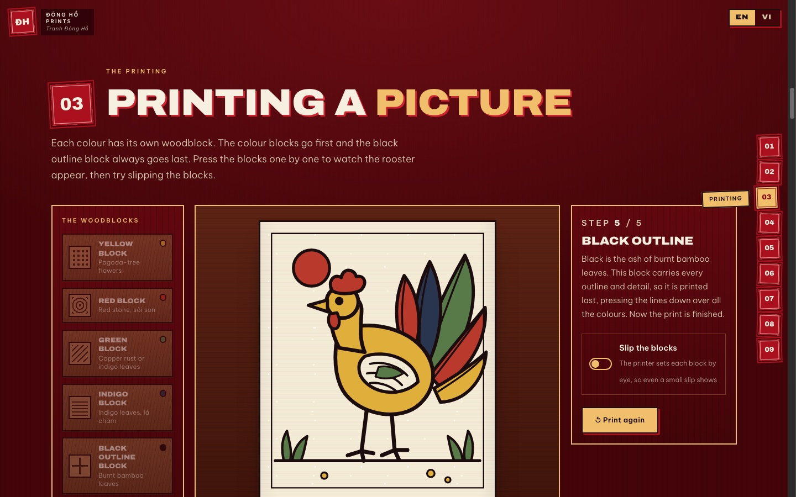
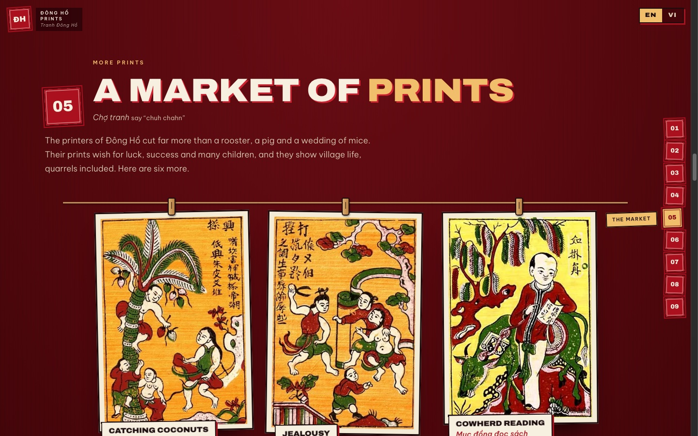
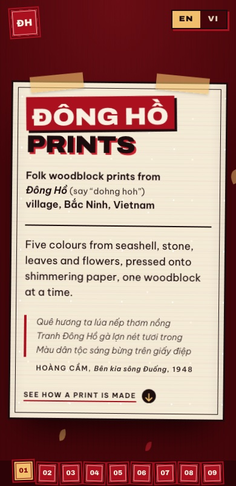

# Đông Hồ Folk Prints · Tranh Đông Hồ

An illustrated, interactive guide to **Đông Hồ woodblock prints**, the folk art of Bắc Ninh province in northern Vietnam. It follows one print from a sheet of shimmering *điệp* paper to the finished picture, and lets you press the woodblocks yourself.

The site is English-first, with a full Vietnamese version. Vietnamese names and terms appear inside the English text with a light pronunciation guide.



## What is in it

The page is one long scroll in nine chapters, with a row of numbered seals on the side to jump between them.

| #   | Chapter             | What you can do                                                                                        |
| --- | ------------------- | ------------------------------------------------------------------------------------------------------ |
| 01  | Intro               | Meet the village, the two best-known prints and Hoàng Cầm's poem about them                            |
| 02  | The making          | Click through a print's making (drawing, carving, paper, colours, printing, drying), with the waits in the sun |
| 03  | The paper           | Learn why the ground is *giấy điệp* (dó paper coated with powdered seashell) and why the colours seem to glow |
| 04  | Colour from nature  | Choose where each colour comes from (flowers, leaves, stone, shell) and watch the yin-yang pig change  |
| 05  | The printing        | Now that the paper and colours are known, press four colour blocks and the black outline block in any order and watch the rooster appear. A switch lets the blocks slip out of register, as they do by hand |
| 06  | Reading a print     | Read the wedding of the mice, panel by panel                                                           |
| 07  | More prints         | Browse six more prints on a market stall, then compare an Đông Hồ print with one from Hàng Trống      |
| 08  | What remains        | See how much of the craft survives: figures from the reports made for UNESCO's file, with sources     |
| 09  | Closing             | A short close                                                                                          |

The order is deliberate: the overview of the making comes first, then the paper and the colours, so that pressing the woodblocks in chapter 05 means more.

### Colour from nature



### Printing a picture



### A market of prints



### On a phone



## Tech

- [Next.js](https://nextjs.org) 16 (App Router, Cache Components) and React 19
- Tailwind CSS 4 plus hand-written CSS in `app/globals.css`
- TypeScript
- Fonts through `next/font`: Archivo (display) and Be Vietnam Pro (body, designed for Vietnamese diacritics)
- The rooster and the pig are drawn in SVG, and every colour is its own layer, like a woodblock
- Two languages, `/en` and `/vi`, from plain dictionaries in `lib/i18n`, with no i18n library
- Generated favicon, Apple icon and Open Graph image (`app/icon.tsx`, `app/apple-icon.tsx`, `app/[lang]/opengraph-image.tsx`), plus `robots.txt` and `sitemap.xml`

## Run it

```bash
npm install
npm run dev
```

Open [http://localhost:3000](http://localhost:3000). The bare address redirects to `/en`.

```bash
npm run build   # production build
npm run start   # serve the build
npm run lint
```

Set `NEXT_PUBLIC_SITE_URL` (for example `https://your-domain.example`) when you deploy. It is used for canonical links, the share image and the sitemap. Without it, `http://localhost:3000` is used.

## Project layout

```
app/[lang]/        page, layout and share image for /en and /vi
components/        one component per chapter, plus Loader, Hero, Seals, LangSwitch
components/art/    the woodblock-style SVG art (rooster, pig, wood texture)
components/press/  the printing demo (chapter 05) and the layered rooster and pig
lib/i18n/          dictionaries (en, vi) and helpers
public/prints/     photographs of historic prints
docs/preview/      the screenshots in this README
```

## Credits

- The photographs of historic prints in chapter 07 and the comparison are public domain, from [Wikimedia Commons](https://commons.wikimedia.org). Each one is credited on the page.
- The epigraph is from Hoàng Cầm, *Bên kia sông Đuống* (1948).
- The rooster and the pig are drawn in SVG in this repository (`components/art/`).

---

Made by **Gnoud**
